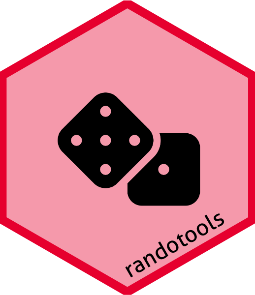

<!-- README.md is generated from README.Rmd. Please edit that file -->

# `randolist` 

<!-- badges: start -->

[](https://github.com/CTU-Bern/randolist)
[](https://github.com/CTU-Bern/randolist/actions)

<!-- badges: end -->

`randolist` contains home-grown functions for creating randomisation
lists in R.

## Installation

You can install the development version of `randolist` from github with:

<!-- install.packages("randolist") -->

``` r
remotes::install_github("CTU-Bern/randolist")
```

<!-- Or from CTU Bern's package universe -->
<!-- ``` r -->
<!-- install.packages("randolist", repos = c('https://ctu-bern.r-universe.dev', 'https://cloud.r-project.org')) -->
<!-- ``` -->

## Generating randomization lists

Generate the randomisation list itself with `randolist`.

``` r
library(randolist)
set.seed(123)
r <- randolist(50, arms = c("Trt1", "Trt2"), strata = list(sex = c("Female", "Male")))
```

Create a short summary of the randomisation list with `summary`.

``` r
summary(r)
#> ---- Randomisation list report ----
#> -- Overall
#> Total number of randomisations:  106 
#> Randomisation groups:  Trt1 Trt2 
#> Randomisation ratio: 1:1 
#> Randomisations to each arm: 1:1
#> Trt1 Trt2 
#>   53   53 
#> Block sizes:
#>  2  4  6 
#>  9 13  6 
#> -- Stratifier level 
#> Randomisation list is stratified by variables sex 
#> -  1 
#> Randomisations per level of sex :
#> Female   Male 
#>     54     52 
#> Balance per level of sex :        
#>          Trt1 Trt2
#>   Female   27   27
#>   Male     26   26
#> -- Stratum level 
#> 2 strata are defined:
#> 
#> Female   Male 
#>     54     52 
#> -  Female 
#> Number of randomisations:  54
#> Trt1 Trt2 
#>   27   27 
#> Block sizes: 
#> 2 4 6 
#> 5 5 4 
#> -  Male 
#> Number of randomisations:  52
#> Trt1 Trt2 
#>   26   26 
#> Block sizes: 
#> 2 4 6 
#> 4 8 2
```

Export the randomisation list in a database compatible format with
`randolist_to_db`.

``` r
randolist_to_db(r, target_db = "REDCap",
                strata_enc = list(sex = data.frame(sex = c("Female", "Male"),
                                                   code = 1:2)),
                rando_enc = data.frame(arm = c("Trt1", "Trt2"),
                                       rand_result = 1:2)
                )
```

### Acknowledgements

Development of the package was funded in part via a grant from the
[Swiss Clinical Trial Organization Statistics and Methodology
Platform](https://www.sctoplatforms.ch/en/scto-platforms/statistics-methodology-5.html).

The package logo was created with
[`ggplot2`](https://ggplot2.tidyverse.org/) and
[`hexSticker`](https://github.com/GuangchuangYu/hexSticker) with icons
from [Font Awesome](https://fontawesome.com/).
